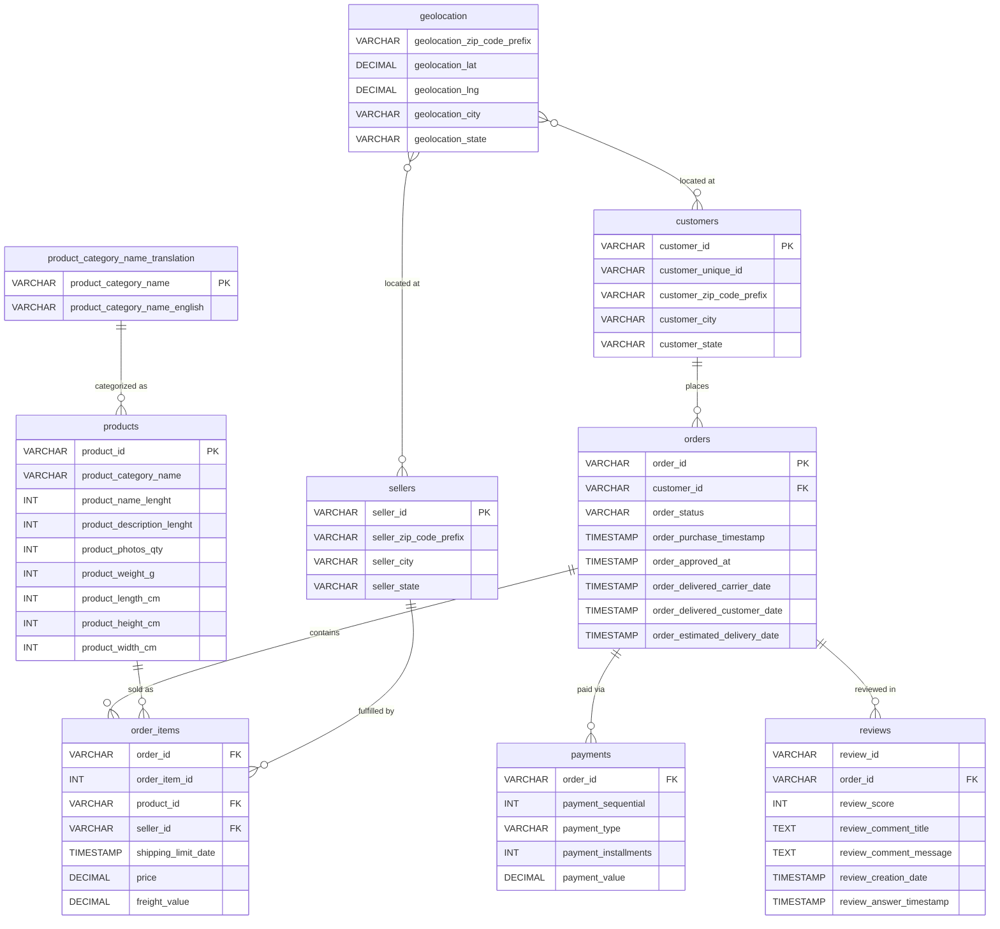
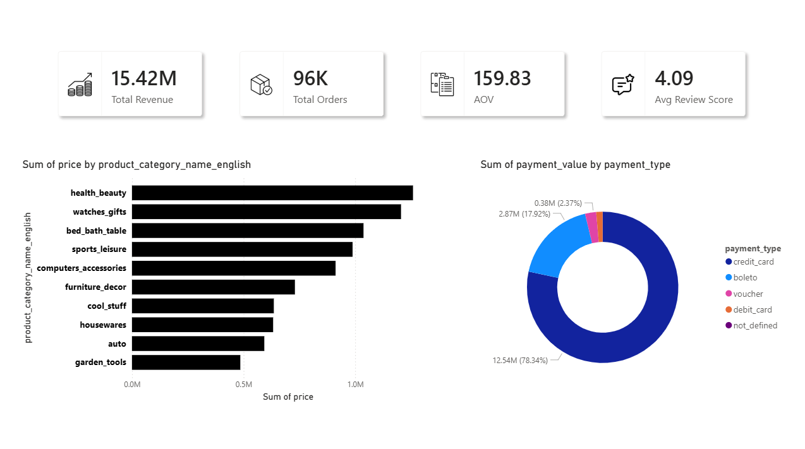

# Brazilian E-Commerce Sales Analysis

## Executive Summary

An end-to-end data analysis of over 100,000 commercial transactions from the Brazilian e-commerce platform Olist, covering the period from 2016 through 2018. This project demonstrates a structured approach to exploratory data analysis using PostgreSQL, with a focus on revenue performance, customer behavior, delivery operations, and product category insights.

The objective is to extract actionable business intelligence from raw transactional data and present findings in a clear, reproducible manner suitable for stakeholder review.

---

## Table of Contents

- [Business Context](#business-context)
- [Data Architecture](#data-architecture)
- [Technical Stack](#technical-stack)
- [Analysis Scope](#analysis-scope)
- [Key Findings](#key-findings)
- [How to Reproduce](#how-to-reproduce)
- [Acknowledgements](#acknowledgements)

---

## Business Context

Olist is a Brazilian marketplace platform that connects small businesses to major retail channels. Merchants list their products on the Olist Store and ship directly to customers through Olist's logistics partners.

This dataset was made publicly available by Olist on Kaggle and has been anonymized for commercial confidentiality. It provides a realistic foundation for analyzing multi-table relational data in a retail e-commerce context, covering the full order lifecycle from purchase to delivery and post-sale review.

The analysis addresses the following business questions:

**Revenue and Sales Performance**
- What is the total revenue and how does it trend month over month?
- Which product categories generate the highest revenue?
- What is the average order value, and how is it distributed?

**Customer Analysis**
- Which states and cities contribute the most revenue?
- What is the repeat purchase rate?
- How can customers be segmented by spending behavior?

**Delivery and Service Quality**
- What is the average delivery time?
- What percentage of orders are delivered late?
- How does delivery performance correlate with customer satisfaction?

**Payment Behavior**
- What payment methods are most commonly used?
- How does payment method relate to order value?

---

## Data Architecture

The database follows a normalized relational schema. The entity-relationship diagram below illustrates the full data model and table relationships.

> See [er-diagram.mermaid](./er-diagram.mermaid) for the source file.



### Relationship Summary

| Relationship | Type | Join Key |
|---|---|---|
| customers to orders | One-to-Many | customer_id |
| orders to order_items | One-to-Many | order_id |
| orders to payments | One-to-Many | order_id |
| orders to reviews | One-to-Many | order_id |
| products to order_items | One-to-Many | product_id |
| sellers to order_items | One-to-Many | seller_id |
| category_translation to products | One-to-Many | product_category_name |
| geolocation to customers/sellers | Many-to-Many | zip_code_prefix |

---

**Source:** [Kaggle - Brazilian E-Commerce Public Dataset by Olist](https://www.kaggle.com/datasets/olistbr/brazilian-ecommerce)

---

## Technical Stack

| Component | Technology |
|---|---|
| Database | PostgreSQL 18 |
| Administration | pgAdmin 4 |
| Query Language | SQL (PostgreSQL dialect) |
| Version Control | Git / GitHub |

---

## Analysis Scope

### 1. Revenue and Sales Performance

Queries examine total revenue, monthly revenue trend, top-performing product categories by gross sales, and average order value distribution including median calculation using `PERCENTILE_CONT`. A supplementary analysis of revenue by day of week identifies purchasing patterns within the weekly cycle.

### 2. Customer Analysis

Geographic segmentation identifies the top revenue-contributing states and cities. Repeat purchase rate is calculated using `customer_unique_id` to account for customers with multiple `customer_id` entries. A spending-based segmentation classifies customers into High, Medium, and Low spender tiers using conditional aggregation.

### 3. Delivery and Service Quality

Delivery performance is measured by average fulfillment time (order to delivery), and the percentage of orders delivered after the estimated delivery date. A cross-analysis between delivery timeliness and review scores quantifies the impact of late deliveries on customer satisfaction. The worst-performing product categories by average review score are identified with a minimum threshold of 50 reviews to ensure statistical relevance.

### 4. Payment Behavior

Payment method distribution is analyzed by transaction count, total value, and average transaction size. This provides visibility into consumer payment preferences across the Brazilian market.

---

## Key Findings

## Sales Performance Overview



> Replace the placeholders below with actual query results after execution.

| Metric | Value |
|---|---|
| Total Revenue (delivered orders) | R$ ___ |
| Total Orders (delivered) | ___ |
| Average Order Value | R$ ___ |
| Median Order Value | R$ ___ |
| Repeat Customer Rate | ___% |
| Average Delivery Time | ___ days |
| Late Delivery Rate | ___% |
| Avg Review Score (On Time) | ___ / 5 |
| Avg Review Score (Late) | ___ / 5 |
| Top Product Category | ___ |
| Most Used Payment Method | ___ |

---

## SQL Analysis Detail

### Revenue and Sales Analysis

#### 1. Total Revenue

Aggregates gross revenue across all delivered orders, separating product revenue from freight charges to provide a clear view of net commercial performance.

```sql
SELECT 
    COUNT(DISTINCT o.order_id) AS total_orders,
    ROUND(SUM(oi.price)::NUMERIC, 2) AS total_product_revenue,
    ROUND(SUM(oi.freight_value)::NUMERIC, 2) AS total_freight,
    ROUND(SUM(oi.price + oi.freight_value)::NUMERIC, 2) AS total_revenue
FROM orders o
JOIN order_items oi ON o.order_id = oi.order_id
WHERE o.order_status = 'delivered';
```

#### 2. Monthly Revenue Trend

Time-series decomposition of revenue by calendar month. This query is the foundation for identifying seasonality, growth trajectory, and anomalous periods that warrant further investigation.

```sql
SELECT 
    TO_CHAR(o.order_purchase_timestamp, 'YYYY-MM') AS month,
    COUNT(DISTINCT o.order_id) AS total_orders,
    ROUND(SUM(oi.price)::NUMERIC, 2) AS product_revenue,
    ROUND(SUM(oi.price + oi.freight_value)::NUMERIC, 2) AS total_revenue
FROM orders o
JOIN order_items oi ON o.order_id = oi.order_id
WHERE o.order_status = 'delivered'
GROUP BY TO_CHAR(o.order_purchase_timestamp, 'YYYY-MM')
ORDER BY month;
```

#### 3. Top 10 Product Categories by Revenue

Identifies the highest-grossing product categories by joining the Portuguese category names to their English translations. The `COALESCE` function handles unmapped categories gracefully.

```sql
SELECT 
    COALESCE(t.product_category_name_english, 'Unknown') AS category,
    COUNT(*) AS items_sold,
    ROUND(SUM(oi.price)::NUMERIC, 2) AS revenue,
    ROUND(AVG(oi.price)::NUMERIC, 2) AS avg_price
FROM order_items oi
JOIN products p ON oi.product_id = p.product_id
JOIN orders o ON oi.order_id = o.order_id
LEFT JOIN product_category_name_translation t 
    ON p.product_category_name = t.product_category_name
WHERE o.order_status = 'delivered'
GROUP BY t.product_category_name_english
ORDER BY revenue DESC
LIMIT 10;
```

#### 4. Average Order Value Distribution

Calculates mean, minimum, maximum, and median order values. The median is computed using `PERCENTILE_CONT` to provide a more robust measure of central tendency than the arithmetic mean, which is sensitive to outliers in transaction data.

```sql
SELECT 
    ROUND(AVG(order_total)::NUMERIC, 2) AS avg_order_value,
    ROUND(MIN(order_total)::NUMERIC, 2) AS min_order_value,
    ROUND(MAX(order_total)::NUMERIC, 2) AS max_order_value,
    ROUND(PERCENTILE_CONT(0.5) WITHIN GROUP (ORDER BY order_total)::NUMERIC, 2) AS median_order_value
FROM (
    SELECT 
        o.order_id,
        SUM(oi.price + oi.freight_value) AS order_total
    FROM orders o
    JOIN order_items oi ON o.order_id = oi.order_id
    WHERE o.order_status = 'delivered'
    GROUP BY o.order_id
) sub;
```

#### 5. Revenue by Day of Week

Reveals intra-week purchasing patterns, enabling targeted marketing and operational resource planning aligned to peak demand days.

```sql
SELECT 
    TO_CHAR(o.order_purchase_timestamp, 'Day') AS day_of_week,
    EXTRACT(DOW FROM o.order_purchase_timestamp) AS day_num,
    COUNT(DISTINCT o.order_id) AS total_orders,
    ROUND(SUM(oi.price)::NUMERIC, 2) AS revenue
FROM orders o
JOIN order_items oi ON o.order_id = oi.order_id
WHERE o.order_status = 'delivered'
GROUP BY 
    TO_CHAR(o.order_purchase_timestamp, 'Day'),
    EXTRACT(DOW FROM o.order_purchase_timestamp)
ORDER BY day_num;
```

---

### Customer Analysis

#### 6. Top 10 States by Revenue

Geographic revenue distribution at the state level. Brazil's economic activity is heavily concentrated in the southeast, and this query quantifies the degree of that concentration in the Olist marketplace.

```sql
SELECT 
    c.customer_state,
    COUNT(DISTINCT c.customer_unique_id) AS total_customers,
    COUNT(DISTINCT o.order_id) AS total_orders,
    ROUND(SUM(oi.price)::NUMERIC, 2) AS total_revenue
FROM customers c
JOIN orders o ON c.customer_id = o.customer_id
JOIN order_items oi ON o.order_id = oi.order_id
WHERE o.order_status = 'delivered'
GROUP BY c.customer_state
ORDER BY total_revenue DESC
LIMIT 10;
```

#### 7. Top 10 Cities by Revenue

Drills down from state-level to city-level granularity. Useful for identifying high-density markets suitable for localized marketing campaigns or logistics hub placement.

```sql
SELECT 
    c.customer_city,
    c.customer_state,
    COUNT(DISTINCT c.customer_unique_id) AS total_customers,
    ROUND(SUM(oi.price)::NUMERIC, 2) AS total_revenue
FROM customers c
JOIN orders o ON c.customer_id = o.customer_id
JOIN order_items oi ON o.order_id = oi.order_id
WHERE o.order_status = 'delivered'
GROUP BY c.customer_city, c.customer_state
ORDER BY total_revenue DESC
LIMIT 10;
```

#### 8. Repeat Customer Rate

Measures customer retention by calculating the percentage of unique customers who placed more than one order. The use of `customer_unique_id` rather than `customer_id` is critical here, as a single individual may hold multiple customer IDs across transactions.

```sql
SELECT 
    COUNT(*) AS total_unique_customers,
    SUM(CASE WHEN order_count > 1 THEN 1 ELSE 0 END) AS repeat_customers,
    ROUND(100.0 * SUM(CASE WHEN order_count > 1 THEN 1 ELSE 0 END) / COUNT(*), 2) AS repeat_pct
FROM (
    SELECT 
        c.customer_unique_id,
        COUNT(DISTINCT o.order_id) AS order_count
    FROM customers c
    JOIN orders o ON c.customer_id = o.customer_id
    WHERE o.order_status = 'delivered'
    GROUP BY c.customer_unique_id
) sub;
```

#### 9. Customer Segmentation by Spending

Classifies customers into three tiers based on cumulative spend. This segmentation enables differentiated engagement strategies: retention programs for high spenders, upsell campaigns for mid-tier, and activation efforts for the low-spend segment.

```sql
SELECT 
    segment,
    COUNT(*) AS customer_count,
    ROUND(AVG(total_spent)::NUMERIC, 2) AS avg_spent
FROM (
    SELECT 
        c.customer_unique_id,
        SUM(oi.price) AS total_spent,
        CASE 
            WHEN SUM(oi.price) >= 500 THEN 'High Spender'
            WHEN SUM(oi.price) >= 200 THEN 'Medium Spender'
            ELSE 'Low Spender'
        END AS segment
    FROM customers c
    JOIN orders o ON c.customer_id = o.customer_id
    JOIN order_items oi ON o.order_id = oi.order_id
    WHERE o.order_status = 'delivered'
    GROUP BY c.customer_unique_id
) sub
GROUP BY segment
ORDER BY avg_spent DESC;
```

---

### Delivery and Reviews Analysis

#### 10. Delivery Performance Overview

Measures end-to-end fulfillment time from purchase to doorstep delivery. The late delivery percentage is a critical operational KPI, calculated against the estimated delivery date communicated to the customer at time of purchase.

```sql
SELECT 
    ROUND(AVG(EXTRACT(DAY FROM (order_delivered_customer_date - order_purchase_timestamp)))::NUMERIC, 1) AS avg_delivery_days,
    ROUND(MIN(EXTRACT(DAY FROM (order_delivered_customer_date - order_purchase_timestamp)))::NUMERIC, 1) AS fastest_days,
    ROUND(MAX(EXTRACT(DAY FROM (order_delivered_customer_date - order_purchase_timestamp)))::NUMERIC, 1) AS slowest_days,
    ROUND(100.0 * SUM(CASE 
        WHEN order_delivered_customer_date > order_estimated_delivery_date THEN 1 
        ELSE 0 
    END) / COUNT(*), 2) AS late_delivery_pct
FROM orders
WHERE order_status = 'delivered'
  AND order_delivered_customer_date IS NOT NULL;
```

#### 11. Review Score Distribution

Provides a frequency distribution of review scores across all delivered orders. A healthy marketplace typically shows a right-skewed distribution with the majority of scores at 4 or 5. Deviations from this pattern signal systemic quality or fulfillment issues.

```sql
SELECT 
    r.review_score,
    COUNT(*) AS total_reviews,
    ROUND(100.0 * COUNT(*) / SUM(COUNT(*)) OVER(), 2) AS percentage
FROM reviews r
JOIN orders o ON r.order_id = o.order_id
WHERE o.order_status = 'delivered'
GROUP BY r.review_score
ORDER BY r.review_score;
```

#### 12. Delivery Timeliness vs. Customer Satisfaction

Quantifies the direct relationship between delivery performance and review scores. This is one of the most commercially significant findings in the analysis: late deliveries have a measurable negative impact on customer satisfaction, which in turn affects retention, word-of-mouth, and lifetime value.

```sql
SELECT 
    CASE 
        WHEN o.order_delivered_customer_date > o.order_estimated_delivery_date THEN 'Late'
        ELSE 'On Time'
    END AS delivery_status,
    ROUND(AVG(r.review_score)::NUMERIC, 2) AS avg_review_score,
    COUNT(*) AS total_orders
FROM orders o
JOIN reviews r ON o.order_id = r.order_id
WHERE o.order_status = 'delivered'
  AND o.order_delivered_customer_date IS NOT NULL
GROUP BY 
    CASE 
        WHEN o.order_delivered_customer_date > o.order_estimated_delivery_date THEN 'Late'
        ELSE 'On Time'
    END;
```

#### 13. Worst Performing Categories by Review Score

Identifies product categories with the lowest average review scores. A minimum threshold of 50 reviews is applied via `HAVING` to filter out low-volume categories where a small number of negative reviews could disproportionately skew the average.

```sql
SELECT 
    COALESCE(t.product_category_name_english, 'Unknown') AS category,
    ROUND(AVG(r.review_score)::NUMERIC, 2) AS avg_score,
    COUNT(*) AS total_reviews
FROM reviews r
JOIN orders o ON r.order_id = o.order_id
JOIN order_items oi ON o.order_id = oi.order_id
JOIN products p ON oi.product_id = p.product_id
LEFT JOIN product_category_name_translation t 
    ON p.product_category_name = t.product_category_name
WHERE o.order_status = 'delivered'
GROUP BY t.product_category_name_english
HAVING COUNT(*) >= 50
ORDER BY avg_score ASC
LIMIT 10;
```

#### 14. Payment Method Analysis

Breaks down payment behavior by method, revealing consumer preferences in the Brazilian market. The installment-based credit card culture in Brazil is a distinctive feature of this market, and understanding payment mix is essential for pricing strategy and checkout optimization.

```sql
SELECT 
    pm.payment_type,
    COUNT(*) AS total_transactions,
    ROUND(SUM(pm.payment_value)::NUMERIC, 2) AS total_value,
    ROUND(AVG(pm.payment_value)::NUMERIC, 2) AS avg_value,
    ROUND(100.0 * COUNT(*) / SUM(COUNT(*)) OVER(), 2) AS percentage
FROM payments pm
JOIN orders o ON pm.order_id = o.order_id
WHERE o.order_status = 'delivered'
GROUP BY pm.payment_type
ORDER BY total_value DESC;
```

---

## How to Reproduce

### Prerequisites

- PostgreSQL 14 or higher
- pgAdmin 4 or any SQL client
- Dataset downloaded from [Kaggle](https://www.kaggle.com/datasets/olistbr/brazilian-ecommerce)

### Steps

1. Clone this repository.

```bash
git clone https://github.com/your-username/brazilian-ecommerce-analysis.git
cd brazilian-ecommerce-analysis
```

2. Create the database and tables.

```bash
psql -U postgres -f sql/01_create_tables.sql
```

3. Import CSV files into each table using pgAdmin Import/Export or the `COPY` command.

```sql
COPY customers FROM '/path/to/olist_customers_dataset.csv'
WITH (FORMAT csv, HEADER true, DELIMITER ',');
```

4. Execute analysis queries in order.

```bash
psql -U postgres -d olist_ecommerce -f sql/02_revenue_analysis.sql
psql -U postgres -d olist_ecommerce -f sql/03_customer_analysis.sql
psql -U postgres -d olist_ecommerce -f sql/04_delivery_reviews_analysis.sql
psql -U postgres -d olist_ecommerce -f sql/05_payment_analysis.sql
```

---

## Acknowledgements

- Dataset published by [Olist](https://www.olist.com/) and made available on [Kaggle](https://www.kaggle.com/datasets/olistbr/brazilian-ecommerce) under CC BY-NC-SA 4.0.
- This project was developed as part of a Business Intelligence and Data Analytics portfolio.

---

## License

This project is intended for educational and portfolio purposes only. The dataset is subject to the original license terms set by Olist.
